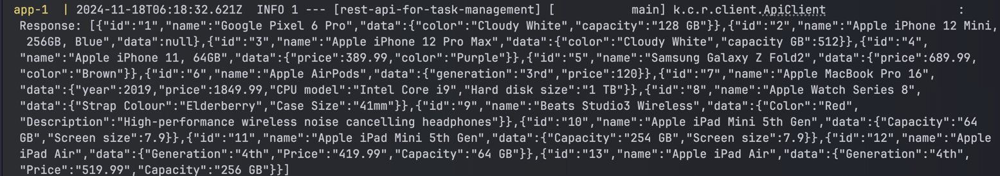
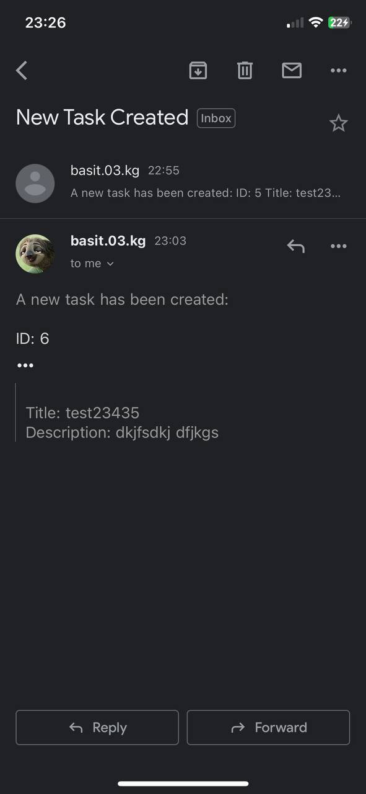

# Запуск

Для начала нужно влючить докер контейнер с редисом

```bash
docker-compose up --build
```

после запускаем ручками

тк когда запускаешь с докерфайла не может подключится к редису. Даже когда есть ДОКЕРКОМПОУЗ общий
2024-11-18 10:55:06 2024-11-18T04:55:06.917Z ERROR 1 --- [rest-api-for-task-management] [nio-4343-exec-2] o.a.c.c.C.[.[.[/].[dispatcherServlet]    : Servlet.service() for servlet [dispatcherServlet] in context with path [] threw exception [Request processing failed: org.springframework.data.redis.RedisConnectionFailureException: Unable to connect to Redis] with root cause
2024-11-18 10:55:06
2024-11-18 10:55:06 java.net.ConnectException: Connection refused
2024-11-18 10:55:06     at java.base/sun.nio.ch.Net.pollConnect(Native Method) ~[na:na]


## 1) Разработать REST API для простого сервиса управления задачами. Должны быть реализованы следующие эндпоинты:

https://github.com/Pur1e/taskService-for-Mega/blob/09b48f8d35ad349c8cab9ca52186d4a70b010440/src/main/java/kg/com/restapifortaskmanagement/controller/TaskController.java

-Создание задачи • POST /api/v1/tasks

-Получение списка всех задач • GET /api/v1/tasks - Get all tasks.

-Обновление задачи • PUT /api/v1/tasks/{id} - Update a task by ID.

-Удаление задачи • DELETE /api/v1/tasks/{id} - Delete a task by ID.

-Получение задачи по ID • GET /api/v1/tasks/{id} - Get task by ID.

## 2) Подключите реляционную базу данных H2 к вашему проекту.

https://github.com/Pur1e/taskService-for-Mega/blob/2e869732622e52a5483814da6e3397c2d2370c93/src/main/resources/application.yml#L7-L15

## 3) Реализуйте логирование запросов и ответов которые проходят через ваш сервис.

https://github.com/Pur1e/taskService-for-Mega/blob/6655c4754b5e162cca65a09c34f749d1ec45956b/src/main/java/kg/com/restapifortaskmanagement/filter/LoggingFilter.java#L16

## 1) Из вашего проекта сделать http запрос (GET) на адрес: https://api.restful-api.dev/objects  Полученный ответ залогировать.

https://github.com/Pur1e/taskService-for-Mega/blob/94eb3f3733d5cbff542b3bf82d7293c24247149d/src/main/java/kg/com/restapifortaskmanagement/client/ApiClient.java#L14


## 2) Напишите unit-тесты для crud методов в вашем service классе для управления задачами.

https://github.com/Pur1e/taskService-for-Mega/blob/caf57cc8c6e76952ecd77795f1333e5ccb4d750b/src/test/java/kg/com/restapifortaskmanagement/TaskServiceTest.java

## 3) Реализуйте отправку созданных задач на email. Можно использовать готовую библиотеку для отправки почты.

https://github.com/Pur1e/taskService-for-Mega/blob/5789aa440dce4ea4a19f5b62d950a92ac84e9df9/src/main/java/kg/com/restapifortaskmanagement/service/impl/EmailServiceImpl.java


# 4) Добавьте Basic Authentication для защиты API.

https://github.com/Pur1e/taskService-for-Mega/blob/09b48f8d35ad349c8cab9ca52186d4a70b010440/src/main/java/kg/com/restapifortaskmanagement/config/SecurityConfig.java

#### username: qwe

#### password: qwe

## 5) Реализуйте кэширование "Получение списка всех задач" с использованием Redis.

https://github.com/Pur1e/taskService-for-Mega/blob/94eb3f3733d5cbff542b3bf82d7293c24247149d/src/main/java/kg/com/restapifortaskmanagement/service/impl/TaskServiceImpl.java#L29-L37

### Вообще считаю что это вообще не правильно тк нельзя хранить настролько валотильные данные. Консистентность будет такая себе и просто сервер будет нагружен

## 6) Напишите dockerfile для вашего проекта

https://github.com/Pur1e/taskService-for-Mega/blob/2e869732622e52a5483814da6e3397c2d2370c93/Dockerfile


